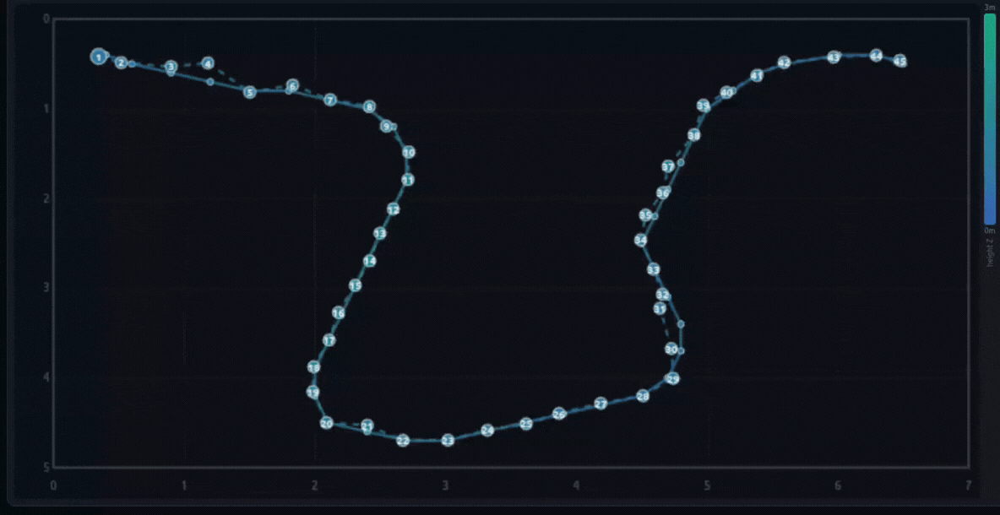

# RF Digital Twin Modeling and Localization for Indoor Wireless Systems [Github](https://github.com/ved1708/Localization-Using-RF-Twin)

This repository presents complete architecture for reconstructing Radio-Frequency Digital Twin from custom indoor 3D scenes using **Radio Frequency 3D Gaussian Splatting [(RF-3DGS Paper)](https://ieeexplore.ieee.org/document/11355734)** and leveraging this digital twin for continuous **indoor trajectory tracking and localization**.

### Software Compatibility

This project is built using:
- **RF-3DGS**: Radio Frequency 3D Gaussian Splatting framework.
- **NVIDIA Sionna**: GPU-accelerated ray tracing for RF simulations [Sionna documentation](https://nvlabs.github.io/sionna/index.html).
- **Blender (3.6+)**: For visual scene and dataset generation.

---

By using neural volumetric representations (3DGS), RF Digital Twin is constructed for evaluating wireless characteristics and performing accurate indoor localization.

## 📍 Localization Demo & Results

This approach enables robust, continuous tracking of users in indoor environments by matching real-time RF measurements against the 3DGS reconstructed radio environment.
### Demo of [RF Digital Twin Model](https://ved1708.github.io/Localization-Using-RF-Twin/DEMO/rfdt_model_demo/)
### Trajectory Tracking 
> *Tracking Demo*
> 

This tracking is facilitated through iterative optimization algorithms built directly on top of the differentiable 3DGS renders, alongside neural network-based regressors trained on the RF environment dataset.

---

## 📊 Localization Metrics

The localization is comprehensively evaluated for Delay RF signatures and compared with traditional optimization against deep learning models:

- **Average Localization Error**: Achieves sub-decimeter accuracy (~0.1m average error), pushing boundaries in multi-path rich environments.
- **Optimization Methods**: Includes zero-shot optimization evaluations utilizing Grid Search (`grid_search_localization.py`) and Gradient Descent (`gradient_descent_localization.py`).

*Table: Localization accuracy across all test locations. All values are in metres.*

| Method | Mean | Median | RMSE | $\varepsilon_{90}$ |
| :--- | :---: | :---: | :---: | :---: |
| kNN ($k=5$) | 1.523 | 1.325 | 1.830 | 3.056 |
| MLP | 0.442 | 0.392 | 0.511 | 0.708 |
| Grid Search Only | 0.407 | 0.374 | 0.444 | 0.508 |
| Grid Search + GD | 0.104 | 0.036 | 0.228 | 0.236 |


---

## �️ Step-by-Step Pipeline

Follow these documentation guides chronologically to successfully recreate the Digital Twin and evaluate localization performance from scratch.

### 0. Installation 
**[INSTALLATION.md](docs/INSTALLATION.md)**

Sets up the environment, including RF-3DGS, NVIDIA Sionna, and Blender.

### 1. Scene Creation 
**[SCENE_CREATION.md](docs/SCENE_CREATION.md)**

Generates the 3D room model (7m × 5m × 3m) equipped with furniture as separate material-based PLY meshes (concrete, wood, glass, metal) alongside a Sionna-ready Scene XML.

**Usage:**
```bash
cd helper_scripts
python create_scene.py
```

### 2. Visual Dataset Generation
**[VISUAL_DATASET.md](docs/VISUAL_DATASET.md)**

Uses Blender's Cycles renderer to synthesize high-quality RGB images capturing diverse viewpoints inside the room for foundational 3DGS visual geometry training.

**Usage:**
```bash
blender --background --python generate_visual_dataset.py -- \
  --meshes_dir=meshes_d \
  --output_dir=dataset_visual \
  --test_ratio=0.10
```

### 3. RF Dataset Generation
**[RF_DATASET.md](docs/RF_DATASET.md)**

Uses NVIDIA Sionna RT to simulate **3.5 GHz** RF transmission paths spanning a 3D grid. The signal profiles are projected to continuous multi-modal heatmaps.

**Usage:**
```bash
# Example: Generate Ideal Delay-resolved spectrum (RGB)
python generate_rf_dataset_0.py --ideal --spectrum-type delay --output-dir dataset_ideal_delay_3.5ghz

# Then, prepare COLMAP structures for 3DGS
cd helper_scripts
python prepare_rf_data.py
```

### 4. 3DGS Model Training
**[TRAINING.md](docs/TRAINING.md)**

Trains the **Radio-Frequency Radiance Fields (RRF)** in two stages. First, learning scene geometry via RGB (Visual stage). Second, fine-tuning the RF attributes (RF stage).

**Usage:**
```bash
# Stage 1: Visual Training
cd RF-3DGS
python train.py -s ../dataset_visual -m output/visual_model --iterations 30000

# Convert point cloud -> .pth checkpoint
python ../helper_scripts/convert_ply_to_pth.py \
  --ply output/visual_model/point_cloud/iteration_30000/point_cloud.ply \
  --out output/visual_model/chkpnt30000.pth

# Stage 2: RF Fine-tuning
python train.py -s ../dataset_ideal_delay_3.5ghz -m output/rf_model_delay_3.5ghz \
  --images spectrum --start_checkpoint output/visual_model/chkpnt30000.pth --iterations 40000
```

### 5. Evaluation and Localization
**[EVALUATION.md](docs/EVALUATION.md)**

Provides rendering pipelines to test generated configurations, and establishes localization via Regression (MLP) or Gradient-Descent optimization.

**Usage:**
```bash
# Render Test Views
cd RF-3DGS
python render.py -m output/rf_model_delay_3.5ghz --iteration 40000 --skip_train

# Generate Single Frame & Localize (Gradient Descent)
cd ..
python generate_csi_dataset.py --ideal --spectrum-type delay --rx-pos 0.4 0.4 1.2 --output-dir localisation_frames_3.5ghz

python gradient_descent_localization.py --target_image localisation_frames_3.5ghz/delay_0.40_0.40_1.20_0.png --model_path RF-3DGS/output/rf_model_delay_3.5ghz --iteration 40000

# Regression Localization (k-NN / MLP)
cd Regressive_models
python evaluate_localization.py
python train_nn_localizer.py

# Batch Evaluation over all frames
./evaluate_all.sh
```

#### Interactive Demo
A Flask based web interface to visualize real-time trajectory tracking.

**Usage:**
```bash
cd DEMO
python demo_server.py
```

---

## 👤 Author & Acknowledgments
- **Project & Repository**: [ved1708/Localization-Using-RF-Twin](https://github.com/ved1708/Localization-Using-RF-Twin)
- **Core Frameworks & Tools**: Adapted around [RF-3DGS](https://ieeexplore.ieee.org/document/11355734), [NVIDIA Sionna](https://nvlabs.github.io/sionna/), [3D Gaussian Splatting](https://repo-sam.inria.fr/fungraph/3d-gaussian-splatting/) & Blender.

